# 2D LiDAR-Based SLAM and Navigation2 for a Differential Drive Robot

## 📌 Overview

This repository contains autonomous navigation of a differential drive mobile robot using **ROS 2 Humble**. The robot uses a **2D LiDAR (Slamtec RPLIDAR A1)** for Simultaneous Localization and Mapping (SLAM) and **Navigation2 (Nav2)** for localization, path planning, obstacle avoidance, and autonomous navigation.
The project has been validated in both **Gazebo simulation** and on a **real hardware platform**. 

---

## Project Features:
- Differential drive robot
- ROS 2 Humble
- URDF/Xacro robot description
- 2D LiDAR integration, Camera and Depth Camera
- SLAM using SLAM Toolbox
- Autonomous navigation using Navigation2
- Obstacle avoidance
- Gazebo Fortress simulation
- Real robot implementation
  
---

# Hardware Implementation

## 🛠 Hardware Components

|Roll No.|           Component                |                 Image                                                                   |      Description   |
|--------|------------------------------------|-----------------------------------------------------------------------------------------|--------------------|
|    1   | Raspberry Pi 4                     | 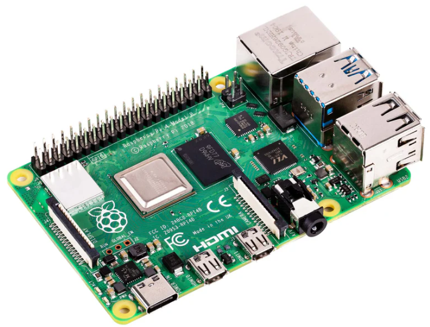| Main onboard computer |
|    2   | Arduino Mega 2560                  |  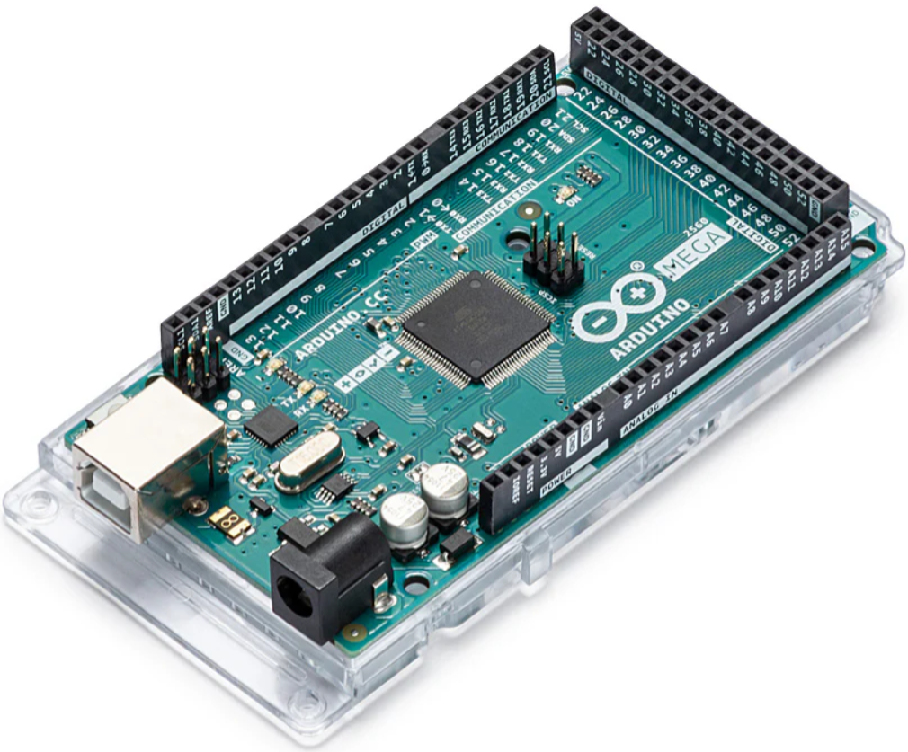| Low-level motor controller |
|    3   | 2D LiDAR                           |  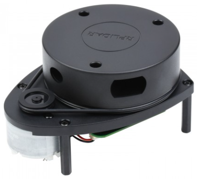| Environment perception |
|    4   | L298N Motor Driver                 | 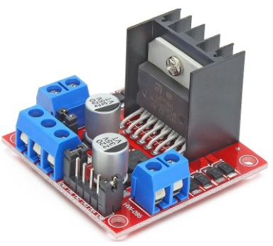| DC motors controls |
|    5   | DC Geared Motors (with encoders)   | 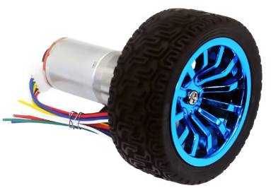| Two 12V 130rpm geared dc motors |
|    6   | Caster Wheel                       | 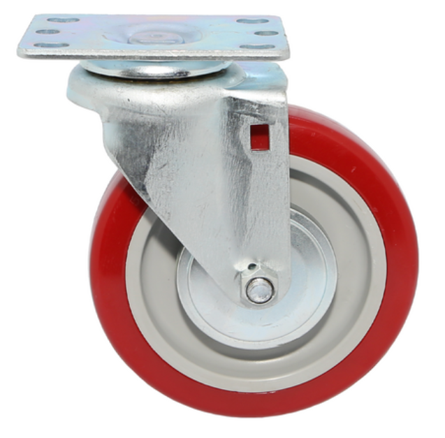 | Robot support |
|    7   | 3S LiPo Battery                    | 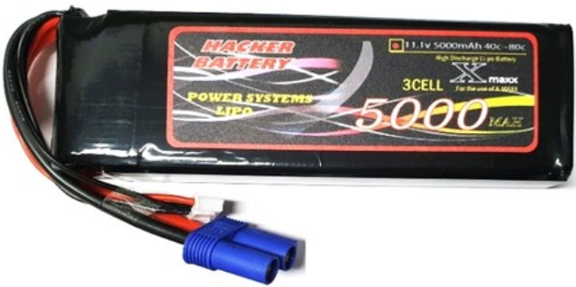| 5000 mAh 11.1v 3S Lipo battery for powering the robot |
|    8   | DC-DC Buck Converter               | 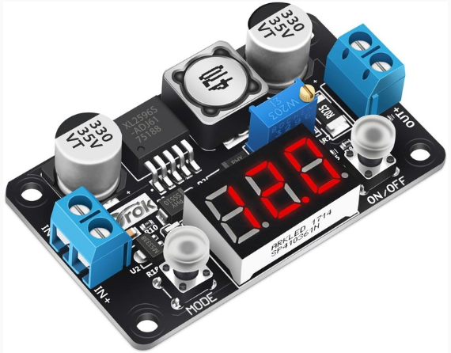| High-power step-down XL4015 5A 75W variable DC converter 5v supply for electronics |
|    9   | Robot Chassis                      |                                                                                         | Mechanical structure |
|    9   |Gamepad controller                  | | Xbox Microsoft 4th generation wireless controller for remote control |

---

## Motor Wiring and Differential Drive Robot Hardware Platform

<p align="center">
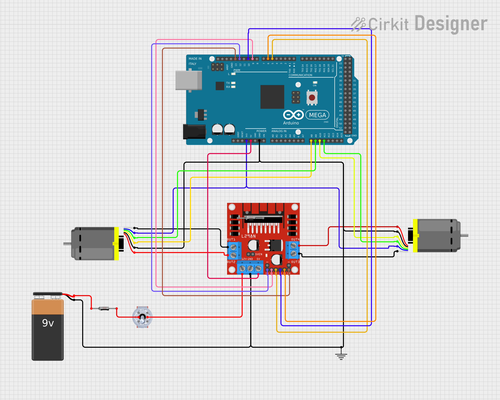
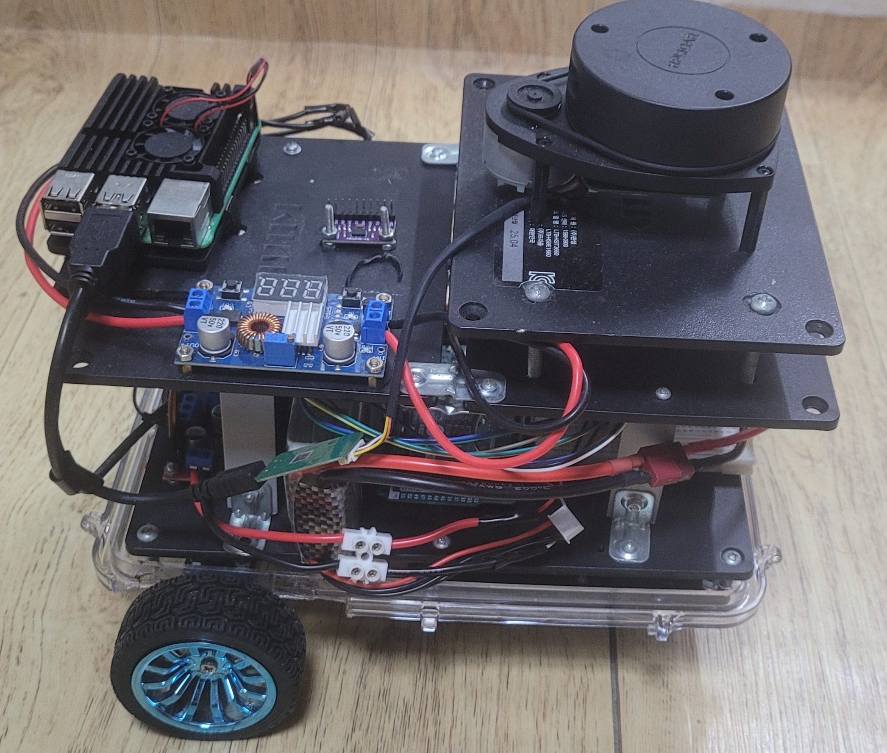
</p>

---
## Arduino mega2560 Pin Configuration

- Clone motor control code from [`ROSArduinoBridge`]( https://github.com/joshnewans/ros_arduino_bridge.git) repository.
- Modify the Interrupt routine encoder reading code (`encoder_drive`) of `ROSArduinoBridge` for Arduino mega2560 since it was written for Arduino Uno.
- Port K port register pins (which are pin A8 to A15) of Arduino mega2560 are used for interrupt routine.
  
|           From                                               | To                    |
| ------------------------------------------------------------  | -----------------------|
| Left Motor Positive terminal                                  | OUT4 L298N motor driver|
| Left Motor Encoder negative terminal                          | GND pin Arduino2560    |
| Left Motor Encoder A phase signal feedback                    | pin A8 Arduino mega2560|
| Left Motor Encoder B phase signal feedback                    | Pin A9 Arduino mega2560|
| Left Motor Encoder positive terminal                          | Arduino mega2560 3V     |
| Left Motor negative terminal                                  | OUT3 L298N motor driver|
| Right Motor positive terminal                                 | OUT1 L298N motor driver |
| Right Motor Encoder negative terminal                      |GND pin Arduino2560|
| Right Motor Encoder A phase signal feedback                | Pin A11 Arduino mega2560|
| Right Motor Encoder B phase signal feedback                | Pin A10 Arduino mega2560 |
| Right Motor Encoder positive terminal                     | Arduino mega2560 3V|
| Right Motor negative terminal                             |OUT2 L298N motor driver |
| Left Motor direction (IN1, L298N motor driver)            | Pin D9 Arduino mega2560|
| Left Motor direction (IN2, L298N motor driver)             | Pin D5 Arduino mega2560|
| Left Motor enable   (ENA, L298N motor driver)              | Pin D12 Arduino mega2560|
| Right Motor direction  (IN3, L298N motor driver)            |Pin D10 Arduino mega2560 |
| Right Motor direction  (IN4, L298N motor driver)            |Pin D6 Arduino mega2560 |
| Right Motor Enable     (ENB, L298N motor driver)            | Pin A13 Arduino mega2560|

---
## Testing Motors
- Upload `ROSArduinoBridge` to Arduino mega2560.
- Clone `serial motor demo` from https://github.com/joshnewans/serial_motor_demo.
- Run `miniterm` to test both open loop and closed loop control. For closed loop control, experimental encoder revolution per count is approximately 1975 for GJA25-375 endoder dc motor.

<table>
<tr>
<td align="center">
<b>Motor Wiring</b><br>

</td>

<td align="center">
<b>Motor Testing Demo</b><br>
<video src="https://github.com/user-attachments/assets/19398011-af18-4047-8f3f-b6f6d7177571" width="400" height="300" controls></video>
</td>
</tr>
</table>

---

# 🧠 Software Stack

## Software Requirements

- Ubuntu 22.04
- ROS 2 Humble
- Gazebo Fortress
- RViz2
- Navigation2
- SLAM Toolbox

---

# Installation

- Install `ROS2 Humble` and `Gazebo fortress` (Gazebo Ignition)
- Clone the repository

```bash
https://github.com/eyasuder/diff_drive_robot.git
```

- Build the workspace

```bash
cd diff_drive

colcon build --symlink-install

source install/setup.bash
```

---

# Running the Project

## 1. Launch Gazebo Simulation

```bash
ros2 launch diff_drive_robot sim.launch.py
```

---

## 2. Start SLAM

```bash
ros2 launch diff_drive_robot online_async_launch.py slam_params_file:=./src/diff_drive_robot/config/mapper_params_online_async.yaml use_sim_time:=true
```

---

## 3. Save the Map

```bash
ros2 run nav2_map_server map_saver_cli -f my_map
```
## 4. Launch AMCL (Adaptive Monte Carlo Localization)

```bash
ros2 launch diff_drive_robot localization_launch.py map:=./path/to/saved/map use_sim_time:=true
```
## 5.  Launch Nav2

```bash
ros2 launch diff_drive_robot navigation_launch.py use_sim_time:=true map_subscribe_transient_local:=true
```

---
# Results

## Mapping

<table>
<tr>
<td align="center">
<b>Mapping simulation</b><br>
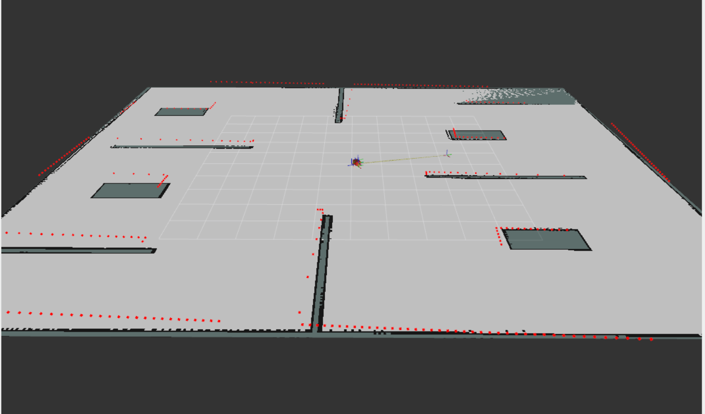
</td>
  
<td align="center">
<b>Motor Testing Demo</b><br>
<video src="https://github.com/user-attachments/assets/280327ed-5290-4da8-bb4b-ab88d4bcd8b2" width="200" height="300" controls></video>
</td>
</tr>
</table>


---

## Navigation

<table>
<tr>
<td align="center">
<b>Global cost map</b><br>
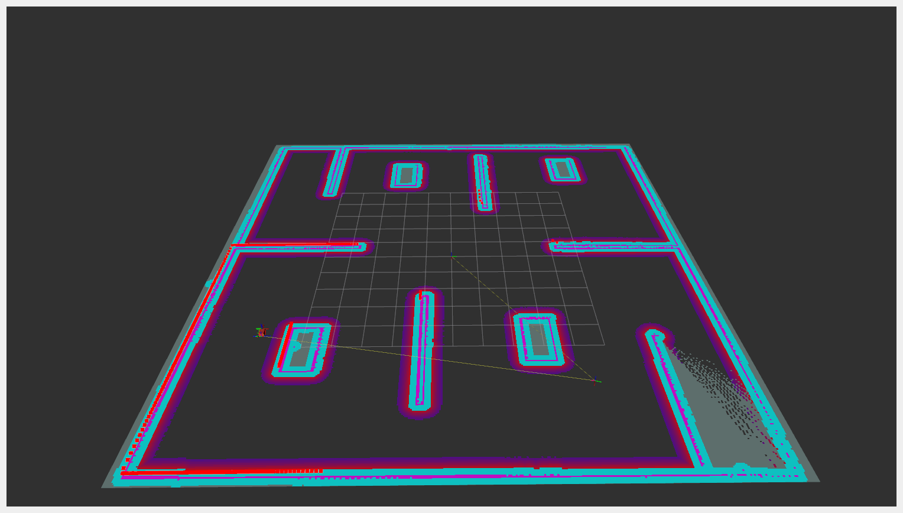
</td>

<td align="center">
<b>Navigation simulation</b><br>
<video src="https://github.com/user-attachments/assets/5ba1655c-bca6-42cb-9042-bd11ef00e408" width="200" height="200" controls></video>
</td>
</tr>
</table>


# Repository Structure

```
diff_robot/
├── src/
    ├── diff_drive_robot/
        ├── config/
        │   ├── controller.yaml
        │   ├── gz_bridge.yaml
        │   ├── joystick.yaml
        │   ├── mapper_params_online_async.yaml
        │   ├── nav2_params.yaml
        │   ├── twist_mux.yaml
        │   └── *.rviz
        │
        ├── launch/
        │   ├── sim.launch.py
        │   ├── online_async_launch.py
        │   ├── localization_launch.py
        │   ├── navigation_launch.py
        │   ├── rplidar.launch.py
        │   └── joystick_controller.launch.py
        │
        ├── robot_urdf_description/
        │   ├── robot_main_urdf.xacro
        │   ├── robot_description.xacro
        │   ├── ros2_control.xacro
        │   ├── gazebo_control.xacro
        │   ├── wheel_macro.xacro
        │   ├── lidar_sensor.xacro
        │   ├── camera_sensor.xacro
        │   ├── depth_camera.xacro
        │   └── inertia.xacro
        │
        ├── worlds/
        │   ├── warehouse_world.sdf
        │   ├── ware_sample.sdf
        │   ├── ware1_sample.sdf
        │   ├── demo_world_fortress.sdf
        │   └── ...
        │
        ├── CMakeLists.txt
        ├── package.xml
        └── README.md

```
